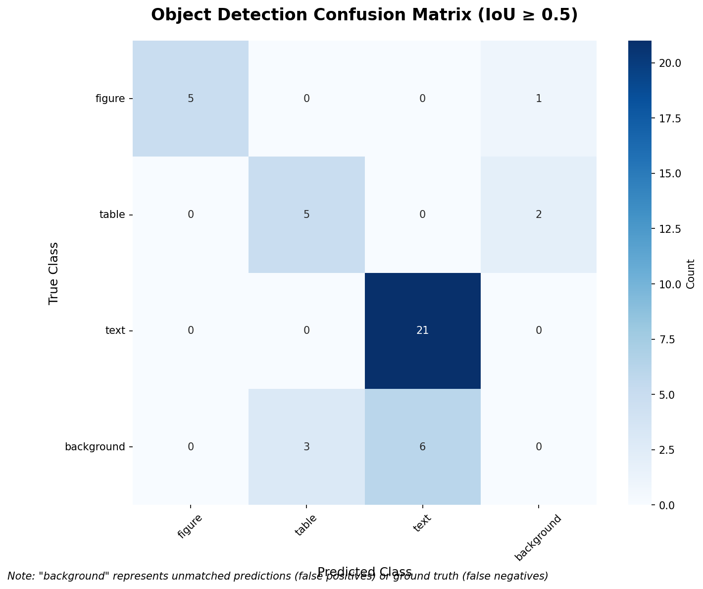

# YOLO11 Practice Project

My hands-on practice project for learning YOLO11 object detection using the TFT-ID dataset to detect figures, tables, and text in document images.

## Project Overview

This project demonstrates how to:
- Load and prepare a custom dataset from Roboflow
- Train a YOLO11 model on custom data
- Validate model performance
- Make predictions on test images
- Visualize detection results

**Dataset**: TFT-ID (Tables, Figures, Text - Image Detection)
- **Source**: [Roboflow Universe](https://universe.roboflow.com/huyifei/tft-id)
- **Classes**: 3 classes (figure, table, text)

## Model Performance




The trained model achieves the following performance metrics on the validation set:
- **mAP@0.5**: 87.2%
- **mAP@0.5:0.95**: 69.9%
- **Precision**: 84.8%
- **Recall**: 87.5%

### Per-Class Performance:
- **Figure**: 99.5% mAP@0.5
- **Table**: 72.0% mAP@0.5
- **Text**: 90.1% mAP@0.5

## Setup

### Prerequisites
- Python 3.12 or higher
- Poetry (for dependency management)
- CUDA-compatible GPU (optional, but recommended for faster training)

### Installation

1. Clone the repository:
```bash
git clone <your-repo-url>
cd yolo11-tut
```

2. Install dependencies using Poetry:
```bash
poetry install
```

3. Activate the virtual environment:
```bash
poetry shell
```

## Usage

### 1. Quick Start with Jupyter Notebook

The easiest way to get started is by following the tutorial notebook:

```bash
cd notebooks
jupyter notebook tutorial.ipynb
```

### 2. Training Your Own Model

```python
from ultralytics import YOLO
import roboflow

# Download dataset from Roboflow
rf = roboflow.Roboflow(api_key="YOUR_API_KEY")
project = rf.workspace("tokyo-fjwy4").project("tft-id-cjkvr")
dataset = project.version("1").download("yolov11")

# Load pre-trained model
model = YOLO("yolo11n.pt")

# Train the model
results = model.train(
    data=f"{dataset.location}/data.yaml",
    epochs=60,
    imgsz=640,
    batch=16,
    device='cpu',  # or 'cuda' if GPU available
    project="runs/train",
    name="custom_yolo_model"
)
```

### 3. Model Validation

```python
# Validate trained model
results = model.val(data=f"{dataset.location}/data.yaml")

# Print metrics
print(f"mAP@0.5: {results.box.map50}")
print(f"mAP@0.5:0.95: {results.box.map}")
print(f"Precision: {results.box.mp}")
print(f"Recall: {results.box.mr}")
```

### 4. Making Predictions

```python
# Load your trained model
model = YOLO("runs/train/custom_yolo_model/weights/best.pt")

# Make predictions
results = model.predict(
    source="path/to/test/images",
    save=True,
    conf=0.3,
    project="runs/predict",
    name="test_results"
)
```

## Dataset Details

- **Name**: TFT-ID (Tables, Figures, Text - Image Detection)
- **Classes**: 
  - `figure`: Visual figures and charts
  - `table`: Data tables
  - `text`: Text blocks and paragraphs

| ID | Class   |
|----|---------|
| 0  | figure  |
| 1  | table   |
| 2  | text    |
- **Format**: YOLO format with bounding box annotations
- **Split**: Train/Validation/Test sets included

## Project Structure

```
yolo11-tut/
├── notebooks/
│   ├── tutorial.ipynb          # Complete tutorial notebook
│   ├── yolo11n.pt             # Pre-trained YOLO11 nano model
│   ├── TFT-ID-1/              # Downloaded dataset
│   │   ├── train/             # Training images and labels
│   │   ├── valid/             # Validation images and labels
│   │   ├── test/              # Test images and labels
│   │   └── data.yaml          # Dataset configuration
│   └── runs/                  # Training and prediction results
│       ├── train/             # Training outputs
│       └── predict/           # Prediction outputs
├── pyproject.toml             # Poetry configuration
├── poetry.lock               # Dependency lock file
└── README.md                 # This file
```

## Key Features

- **Complete workflow**: From dataset download to model deployment
- **Roboflow integration**: Easy dataset management
- **Model evaluation**: Comprehensive metrics and visualizations
- **Prediction pipeline**: Ready-to-use inference code
- **Poetry setup**: Modern Python dependency management

## Notes

- The project uses CPU training by default. For faster training, change `device='cpu'` to `device='cuda'` if you have a compatible GPU
- Training results are saved in the `runs/train/` directory
- Prediction results are saved in the `runs/predict/` directory
- Model weights are saved as `best.pt` and `last.pt` in the training output directory